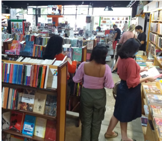

# POO-Programação Orientada a Objetos (UNAMA)

Aluna: Helena Lúcia Auzier Bibas Fialho - 04094808(ADS-Manhã,Turma B).

Repositório dedicado a atividades práticas disciplina de Programação Orientada a Objetos com JAVA, ministrada pela professora  Samara Souza, na UNAMA-2025.

As atividades estarão organizadas em arquivos por assunto passado, onde dentro da pasta estarão organizados por pastas as atividades passadas.

## Classes e objetos

Para a primeira lista de exercícios, existe:

1.**Projeto livraria**

Para questões 1 e 2 do material.

Na primeira questão basicamente foi concluido o projeto criado em sala, com

* alterção e instanciação de dois objetos, através do objeto da classe.
Ex.:
````
        obj1.titulo = "The Garden of Evening Mists";
        obj1.numeroPaginas = 350;
        obj1.anoPublicacao = 2012;
        obj1.preco = 60.00;
````
Objeto1 foi o livro "The Garden of Evening Mists" de Tan Twan Eng.

* impressão dos atributos na tela.Ex.:

````
        System.out.println("Título: " + obj1.titulo);
        System.out.println("Número de páginas: "+ obj1.numeroPaginas);
        System.out.println("Ano publicação: "+obj1.anoPublicacao);
````

* invocação dos método da classe.Ex.:

````
    obj1.vender();

    double frete1 = obj1.calcFrete("00000-000");

    obj1.envio();
````

Para a 2ª questão, analisar a imagem:

 []

* Extrair mais uma classe, definir três atributos e dois métodos: 
````
public class Cliente {
    String nome;
    String cpf;
    String endereco;

    public void cadastrar(){
        System.out.println("Cadastrando cliente no banco de dados...");
    }

    public void comprar (){
        System.out.println("Compra do cliente " + nome +" realizada com sucesso!");
    }
}
````
A nova classe de objetos identificado foram os clientes que estão sendo cadastrados e realizando compras, como no projeto original temos o envio de livros, é uma livraris que trabalha com entrega também, então para o programa eu simulei a compra e o cadastro cliente e do livro, juntamente com o pagamento e o a confirmação do envio.

2.**Projeto Aluno**
    
Para a terceira questão, um sistema de cadastro de notas de alunos e verificação da aprovação.

3.**Projeto Banco**

Para a quarta questão, sistema de consulta bancária, saque e depósito.

4.**Projeto Carro**

Para a quinta questão, um a simulação de um programa que acende um carro.


